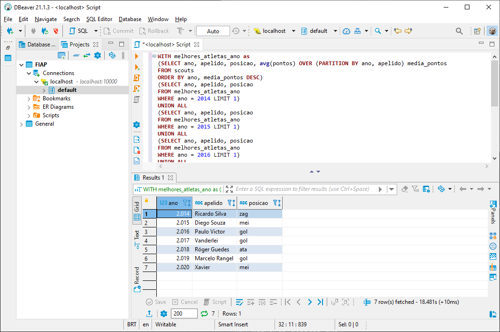
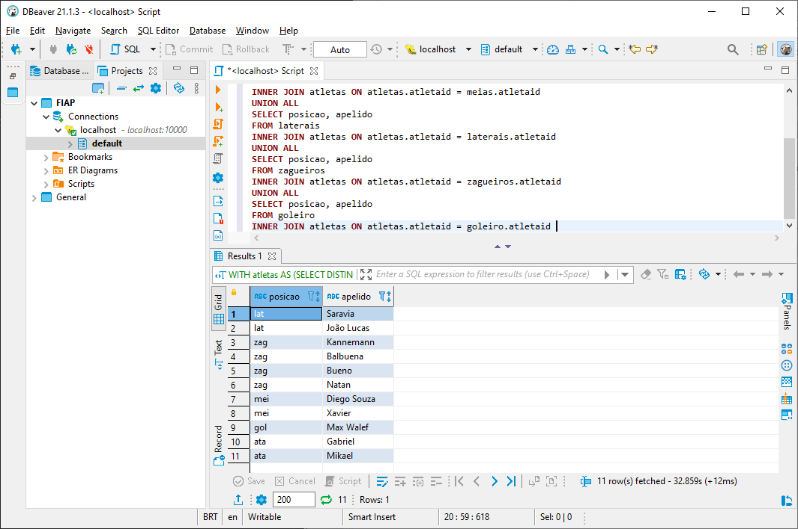

# Consultas
O script pode ser encontrado na pasta scr [consultas.sql](https://github.com/Edher-Santos-EM/fiap-solution-sprint-1/blob/main/src/consultas.sql)

## Quantos registros há na tabela por ano?
```sql
SELECT ano, COUNT(*) as partidas_ano FROM Partidas group by ano order by ano;
```
</img>

##  Quantas equipes únicas mandantes existem?
```sql
SELECT count(distinct home_team) as equipes_unicas FROM Partidas;
```
</img>

```sql
SELECT ano, COUNT(distinct home_team) as equipes_unicas FROM Partidas group by ano order by ano;
```
</img>

## Quantas vezes as equipes mandantes saíram vitoriosas?
```sql
SELECT COUNT(*) as equipes_madantes_vitoriosas FROM Partidas where home_score > away_score;
```
</img>

```sql
SELECT ano, COUNT(*) as equipes_madantes_vitoriosas FROM Partidas where home_score > away_score group by ano order by ano;
```
</img>

## Quantas vezes as equipes visitantes saíram vitoriosas?
```sql
SELECT COUNT(*) AS equipes_madantes_vitoriosas FROM Partidas WHERE home_score < away_score;
```
</img>

```sql
SELECT ano, COUNT(*) AS equipes_madantes_vitoriosas FROM Partidas WHERE home_score < away_score GROUP BY ano ORDER BY ano;
```
</img>

## Quantas partidas resultaram em empate?
```sql
SELECT COUNT(*) as partidas_empatadas FROM Partidas where home_score = away_score;
```
</img>

```sql
SELECT ano, COUNT(*) as equipes_madantes_vitoriosas FROM Partidas where home_score = away_score group by ano order by ano;
```
</img>

## Quais jogadores detêm os melhores scouts gerais e por ano?

```sql
WITH melhores_atletas_ano as
(SELECT ano, apelido, posicao, avg(pontos) OVER (PARTITION BY ano, apelido) media_pontos
FROM scouts 
ORDER BY ano, media_pontos DESC)
(SELECT ano, apelido, posicao
FROM melhores_atletas_ano
WHERE ano = 2014 LIMIT 1)
UNION ALL
(SELECT ano, apelido, posicao
FROM melhores_atletas_ano
WHERE ano = 2015 LIMIT 1)
UNION ALL
(SELECT ano, apelido, posicao
FROM melhores_atletas_ano
WHERE ano = 2016 LIMIT 1)
UNION ALL
(SELECT ano, apelido, posicao
FROM melhores_atletas_ano
WHERE ano = 2017 LIMIT 1)
UNION ALL
(SELECT ano, apelido, posicao
FROM melhores_atletas_ano
WHERE ano = 2018 LIMIT 1)
UNION ALL
(SELECT ano, apelido, posicao
FROM melhores_atletas_ano
WHERE ano = 2019 LIMIT 1)
UNION ALL
(SELECT ano, apelido, posicao
FROM melhores_atletas_ano
WHERE ano = 2020 LIMIT 1)
ORDER BY 1
```

</img>


## Qual é o time ideal?

Selecionamos o seguinte esquema tático 2 atacantes, 2 laterais, 2 meias, 4 zagueiros e 1 goleiro com os melhores médias de pontuação de todos os anos

```sql
WITH atletas AS (SELECT DISTINCT atletaid, apelido FROM scouts)
SELECT posicao, apelido 
FROM atacantes
INNER JOIN atletas ON atletas.atletaid = atacantes.atletaid 
UNION ALL 	
SELECT posicao, apelido 
FROM meias
INNER JOIN atletas ON atletas.atletaid = meias.atletaid 
UNION ALL 
SELECT posicao, apelido 
FROM laterais
INNER JOIN atletas ON atletas.atletaid = laterais.atletaid 
UNION ALL 
SELECT posicao, apelido 
FROM zagueiros
INNER JOIN atletas ON atletas.atletaid = zagueiros.atletaid 
UNION ALL 
SELECT posicao, apelido 
FROM goleiro
INNER JOIN atletas ON atletas.atletaid = goleiro.atletaid 
```
</img>


## Será que podemos preparar a ingestão para o campeonato de 2021?
Sim, com os dados capturados é possível adicionar o arquivo com os dados de 2021 no HDFS e os dados serão atualizados.

## Como capturar os dados direto do Cartola FC?
Os dados podem ser capturados através de api ou então através de uma ferramenta de extração de dados do próprio site do Cartola FC.