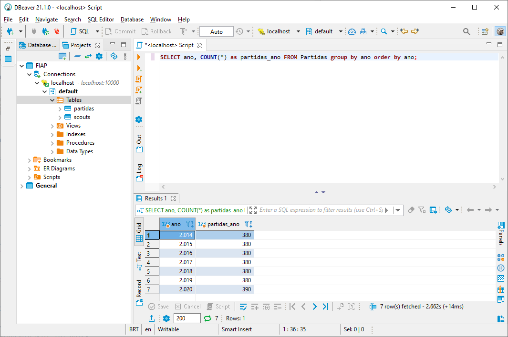
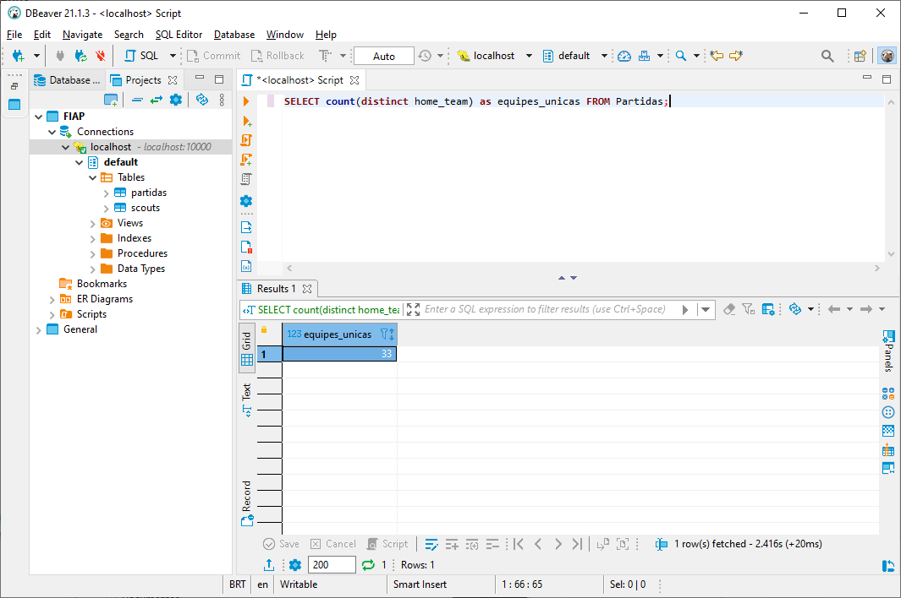
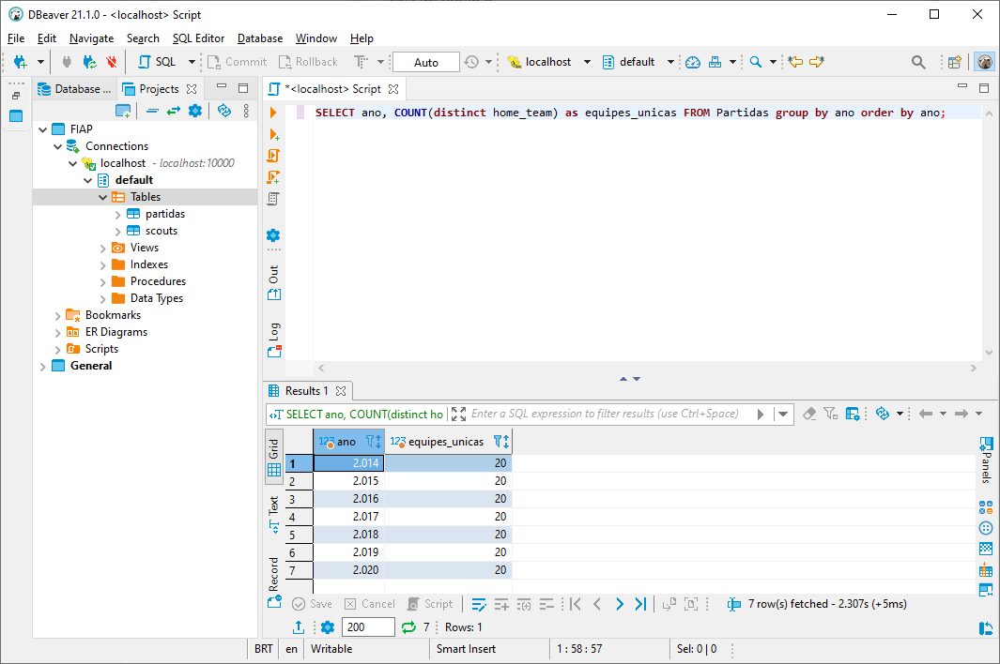
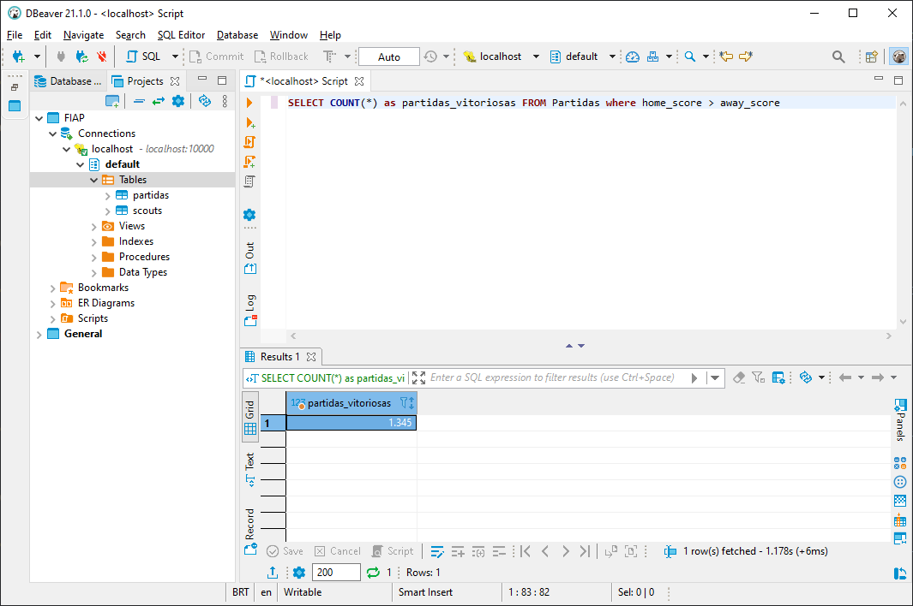
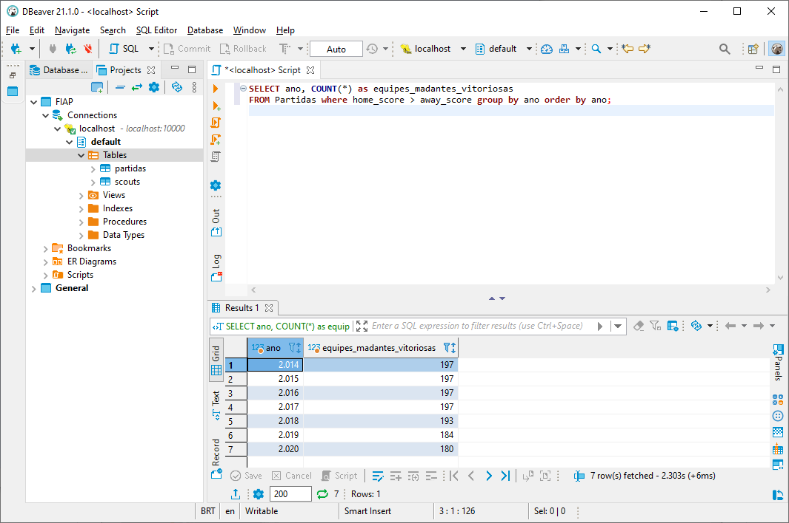
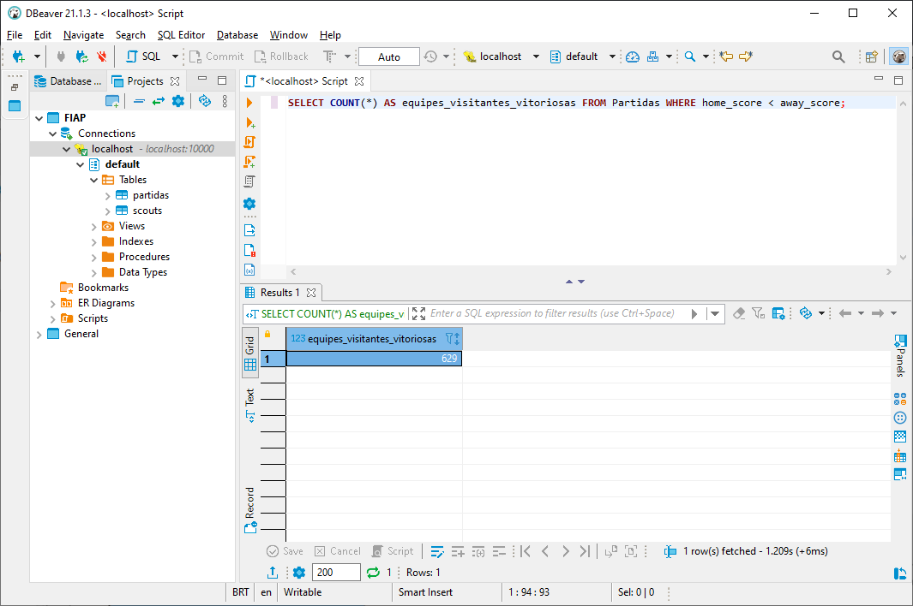
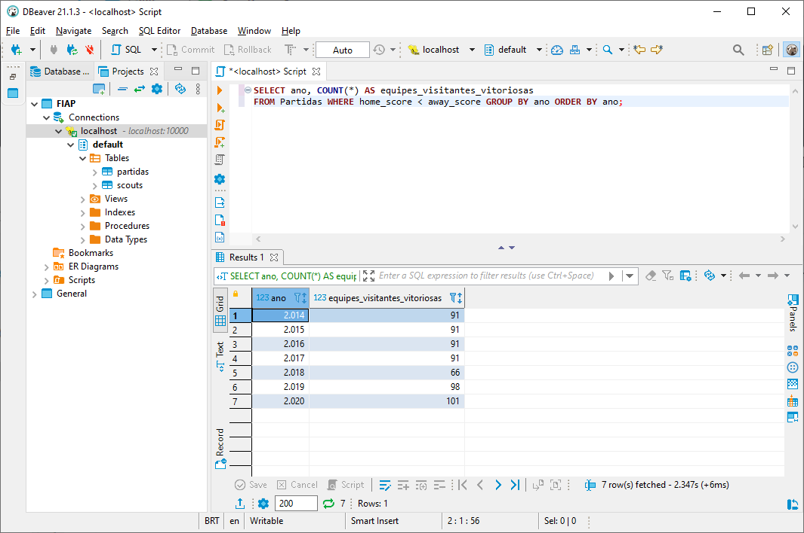
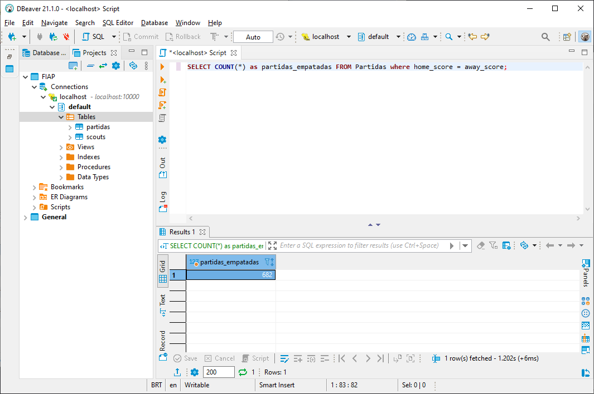

# Consultas
O script pode ser encontrado na pasta scr [consultas.sql](https://github.com/Edher-Santos-EM/fiap-solution-sprint-1/blob/main/src/consultas.sql)

## Quantos registros há na tabela por ano?
```sql
SELECT ano, COUNT(*) as partidas_ano FROM Partidas group by ano order by ano;
```
</img>

##  Quantas equipes únicas mandantes existem?
```sql
SELECT count(distinct home_team) as equipes_unicas FROM Partidas;
```
</img>

```sql
SELECT ano, COUNT(distinct home_team) as equipes_unicas FROM Partidas group by ano order by ano;
```
</img>

## Quantas vezes as equipes mandantes saíram vitoriosas?
```sql
SELECT COUNT(*) as equipes_madantes_vitoriosas FROM Partidas where home_score > away_score;
```
</img>

```sql
SELECT ano, COUNT(*) as equipes_madantes_vitoriosas FROM Partidas where home_score > away_score group by ano order by ano;
```
</img>

## Quantas vezes as equipes visitantes saíram vitoriosas?
```sql
SELECT COUNT(*) AS equipes_madantes_vitoriosas FROM Partidas WHERE home_score < away_score;
```
</img>

```sql
SELECT ano, COUNT(*) AS equipes_madantes_vitoriosas FROM Partidas WHERE home_score < away_score GROUP BY ano ORDER BY ano;
```
</img>

## Quantas partidas resultaram em empate?
```sql
SELECT COUNT(*) as partidas_empatadas FROM Partidas where home_score = away_score;
```
</img>

```sql
SELECT ano, COUNT(*) as equipes_madantes_vitoriosas FROM Partidas where home_score = away_score group by ano order by ano;
```
</img>

## Quais jogadores detêm os melhores scouts gerais e por ano?

## Qual é o time ideal?

## Será que podemos preparar a ingestão para o campeonato de 2021?


## Como capturar os dados direto do Cartola FC?
