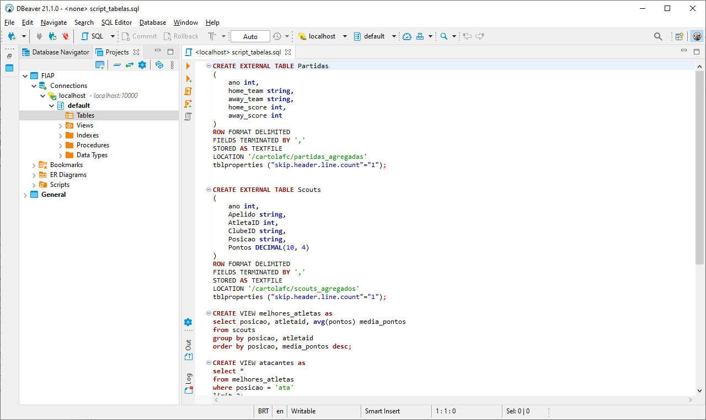

# Criando as tabelas no Hive através do DBeaver

## Configurando a conexão no DBeaver

</img>

## Executando o script de criação

O script pode ser encontrado na pasta scr [script_tabelas.sql](./src/script_tabelas.sql)

</img>
